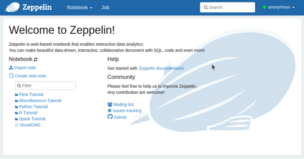

# VisualGNG
An updated implementation of the Visual Growing Neural Gas for exploratory data analysis, as describe in  [Ventocilla et al., 2019](https://www.scitepress.org/PublicationsDetail.aspx?ID=la6GQgbV48M=&t=1). The original version discussed in that paper is found [here](https://github.com/eliovr/visualgng/releases/tag/v1.1).


## Requirements
#### For both GNG and VisualGNG
- [Scala](https://www.scala-lang.org/) (v2.11)
- [Apache Spark](http://spark.apache.org/) (v2.4)


#### For VisualGNG
- [Apache Zeppelin](https://zeppelin.apache.org/) (v0.8)


## Installation
Start by building and packaging the project using [SBT](https://www.scala-sbt.org/).
```bash
cd path/to/visualgng && sbt package
```
Add a reference to the generated jar file (`/path/to/visualgng/target/scala-2.11/visualgng_2.11-1.2.jar`) to the Spark interpreter via the Zeppelin web interface.



Once the dependency is added it is possible to import the needed packages from a notebook.


## Usage
An example using the [MNIST](http://yann.lecun.com/exdb/mnist/) (hand-written digits):

```scala
import se.his.sail.zeppelin.VisualGNG

val df = spark
    .read
    .option("header", false)
    .option("inferSchema", true)
    .csv("/path/to/mnist-train.csv")

val gng = VisualGNG(df)
    .setLabelCol("label")
    .display
```

The `display` method will display the visual elements as an output of the current notebook paragraph, and return a VisualGNG object. By default, VisualGNG assumes that all columns in the dataset will be used in training.

### Parameters
A few options are available before deploying (calling `display`):
- `.setInputCols(columns: Array[String])`: defines which columns to be used for training.
- `.setLabelCol(column: String)`: sets a given column as a label, which means that the column is ignored in training. The values in the column can be of type Int, Double or String. This lets VisualGNG know which attribute to use when assigning labels to units (see the `transform` method below). 
- `.setIdCol(column: String)`: Similar to `setLabelCol`. If `setInputCols` is given, then all other columns, expect this one, will be used for training. The values in the column can be of any type.
- `.setScale(scale: Boolean)`: takes a boolean. Defines whether the training attributes should be scaled to a unit standard deviation or not.


### VisualGNG object
The instantiated VisualGNG object (`gng` in the previous example) has a few methods and attributes that can be used in other paragraphs of the notebook:

- `gng.parallelCoordinates()`: will display a parallel coordinates plot with the values of each prototype vector in the GNG model. This plot dynamically updates along with the GNG's force-directed graph.
- `gng.transform(updateGraph=false)`: returns a new Dataset with the original data and two new columns: the vectors used during training, and a struct with four values: `unitID` (ID of the closest unit to the data point), `distance` (Euclidean distance from the point to the unit), `group` (in case you gave a group of units a name using `groupSelected`), and `label` (same as group). If `updateGraph=true`, then VisualGNG updates the graph with the true density (resizes nodes based on the number of data points each unit represents) and class (colors nodes based on the majority class given by the attributed defined in `setLabelCol`).
- `gng.kmeans(k: Int)`: takes a number for k as an integer and returns a `KMeansModel`. Will run K-means on the trained units and visually encode the result in the force-directed graph.
- `gng.getSelected`: returns the ids (as `Array[Int]`) of the selected nodes/units (i.e., selected in the graph).
- `gng.groupSelected(name: String)`: assigns a name to the group selected nodes.
- `gng.model`: returns the `GNGModel` instance. This can be used as a transformer (in the SparkML sense) on new data.

#### Exporting results

The `gng` object and the model (`gng.model`), have three methods to export the trained model:

- `gng.saveAsJSON(filePath: String)`: saves the model as a JSON string of the form
    ```json
    {
      "nodes": [{
        "id": "Int - unique unit id used during training",
        "trueId": "Int - unit id (indexed from 0 to nodes size)",
        "density": "Double - count of data points represented by the unit",
        "hint": "String - unit id + label (from calling groupSelected)",
        "group": "Int - group id (from calling groupSelected)",
        "data": "Array[Double] - unit's prototype (vector)"
      }],
      "links": [{
        "source": "Int - trueId of the source node",
        "target": "Int - trueId of the target node",
        "distance": "Double - Euclidean distance between source and target prototypes"
      }]
    }
    ```
- `gng.saveAsGML(filePath: String)`: saves the model in [GML format](https://gephi.org/users/supported-graph-formats/gml-format/) (which does not include prototypes).
- `gng.savePrototypes(filePath: String)`: saves units' prototypes as CSV.

## Author
- Elio Ventocilla

## Reference
```
@inproceedings{ventocilla2019,
  title={Visual Growing Neural Gas for Exploratory Data Analysis},
  author={Ventocilla, Elio and Riveiro, Maria},
  booktitle={14th International Joint Conference on Computer Vision, Imaging and Computer Graphics Theory and Applications, 25-27 February, 2019, Prague, Czech Republic},
  volume={3},
  pages={58--71},
  year={2019},
  organization={SciTePress}
}
```
